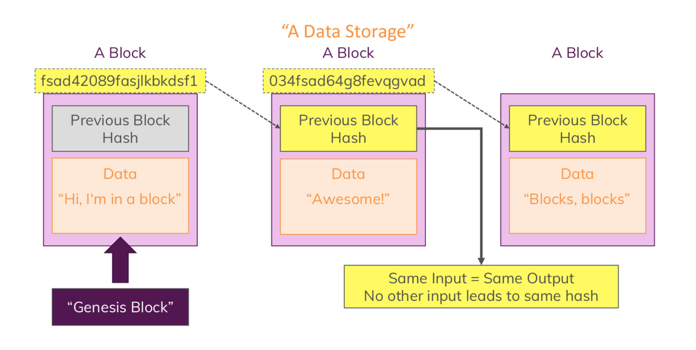
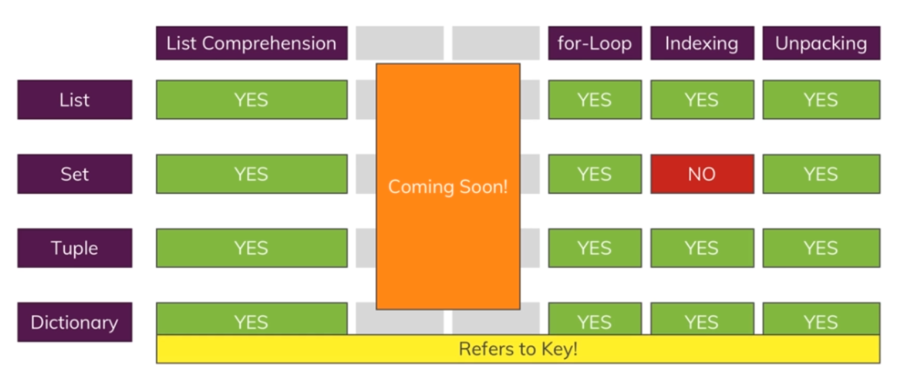

# Blockchain-with-Python

## Python
Python is a powerful, easy to use, object oriented programming language.
* Python is performant, it runs on all Operating Systems and it's extremely versatile.
* Python has a clean and simple syntax, it follows a **"batteries included"** approach and offers great documentation.
> Batteries included signify that just after installing we have various possiblity of using it without any third party packages.
* Python embraces objects, class, inheritance and allows us to easily work with complex data structures.

## Blockchain
A distributed data storage  consisting of containers (blocks) which are connected.

### Cryptocurrency
If the data we store in a block is a list of transactions, the coins transferred in the transactions form our cryptocurrency.

## Different data structures in python

